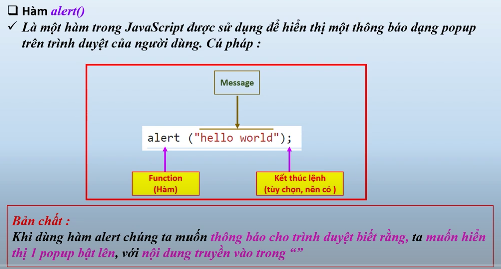
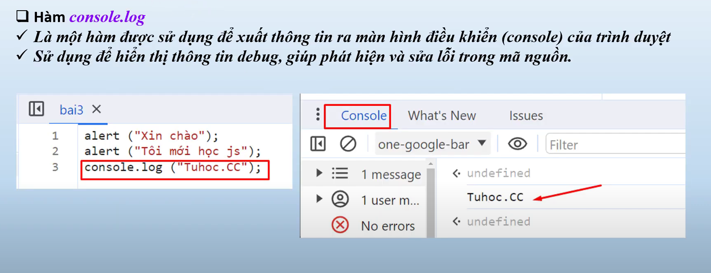

# Nội dung bài học trên youtube
Bài 2. javascript introduction - Những điều cơ bản mà bạn cần biết | Học JavaScript từ A đến Z tuhoc.cc
    - link bài học : https://www.youtube.com/watch?v=hdmqA3ttWmc&list=PLPt6-BtUI22pYwpfmkP4EuJkf6GRe63KU&index=3

Bài 3. Console.log và Alert trong JavaScript - Khóa học js cơ bản chi tiết cho người mới
    - link bài học : https://www.youtube.com/watch?v=3VPQ8cb3ixQ&list=PLPt6-BtUI22pYwpfmkP4EuJkf6GRe63KU&index=4

# Nội dung bài 2:
- Nói về sự ra đời của ngôn ngữ javascript(JS)

# Nội dung bài học 3:
- Tìm hiểu về hàm alert, console.log() để xuất dữ liệu trên trình duyệt

1. Hàm alert là gì ?
- hàm alert là : 
- hàm console.log() là : 

2. Sự khác nhau khi sử dụng 2 hàm alert() và console.log()
- alert()
    + Là một hàm tích hợp sẵn của trình duyệt.
    + Nó hiển thị một hộp thoại popup lên màn hình trình duyệt, bắt buộc người dùng phải nhấn "OK" mới tiếp tục được.
    👉 Dùng để: Hiển thị thông báo ngắn gọn và bắt buộc người dùng phải chú ý.

- console.log()
    + Là một hàm của đối tượng console trong JavaScript.
    + Nó in thông tin ra bảng điều khiển (console) trong Developer Tools của trình duyệt (bạn nhấn F12 để mở).
    👉 Dùng để: Ghi log giá trị, debug chương trình, xem dữ liệu đang xử lý như thế nào.

3. Kết luận:
- alert() không thể hiện nội dung object/mảng một cách chi tiết.
- console.log() có thể bấm vào để mở từng phần tử, rất hữu ích khi debug.

4. ⚠️ 4. Cảnh báo khi dùng alert()
- Làm gián đoạn trải nghiệm người dùng, ví dụ khi họ đang điền form thì popup hiện lên.
- Dễ bị lạm dụng gây khó chịu.
- Trong các trình duyệt hiện đại hoặc khi viết ứng dụng SPA (React, Vue, Angular...), alert gần như không được dùng nữa.
- ok