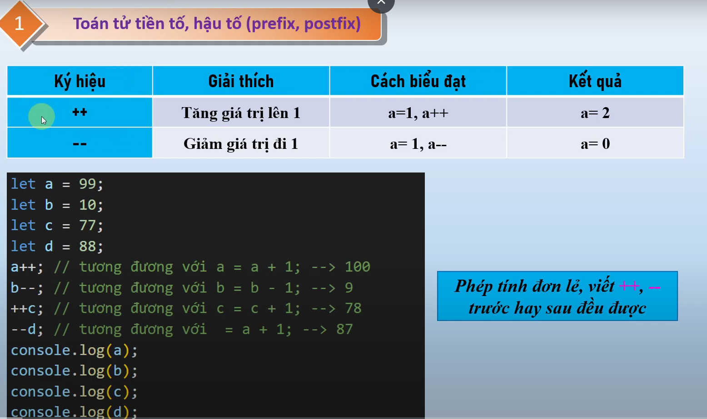
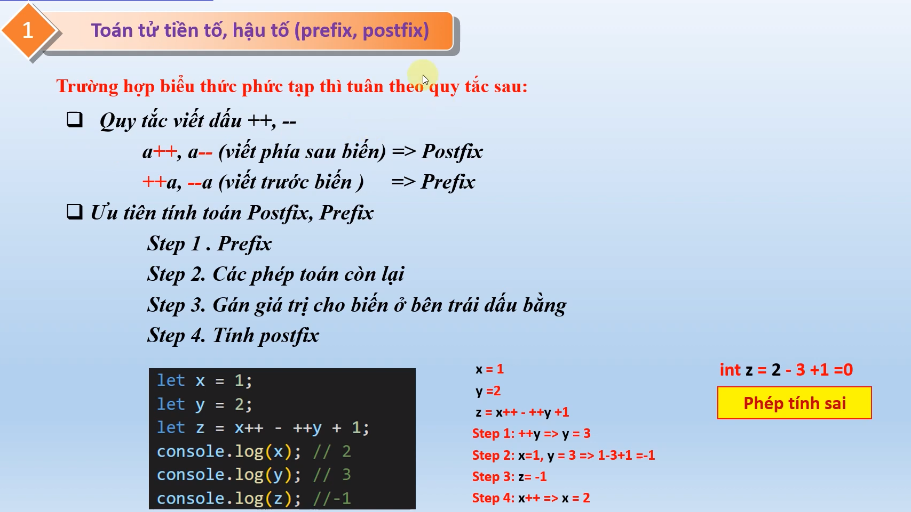

# nội dung bài học trên youtube
Bài 10. Toán tử tăng giảm trong javascript - Toán tử tiền tố, hậu tố (prefix, postfix)
    - link bài học : https://www.youtube.com/watch?v=nHxyF9fuNi4&list=PLPt6-BtUI22pYwpfmkP4EuJkf6GRe63KU&index=14

1. Nội dung bài học 10:
- Xem lại nội dung bài học
- Toán tử gán ++ --  https://youtu.be/nHxyF9fuNi4?list=PLPt6-BtUI22pYwpfmkP4EuJkf6GRe63KU&t=10
- Toán tử gán với tiền tố và hậu tố prefix postfix  https://youtu.be/nHxyF9fuNi4?list=PLPt6-BtUI22pYwpfmkP4EuJkf6GRe63KU&t=217