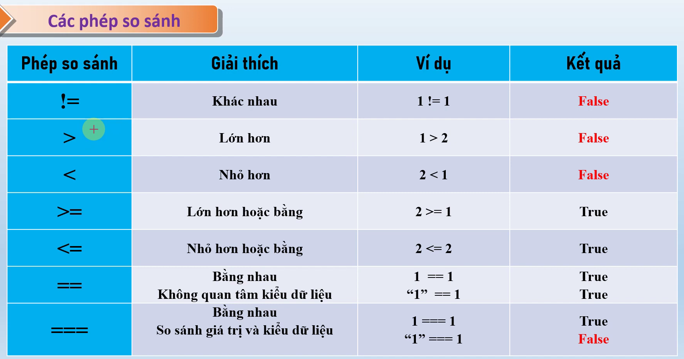
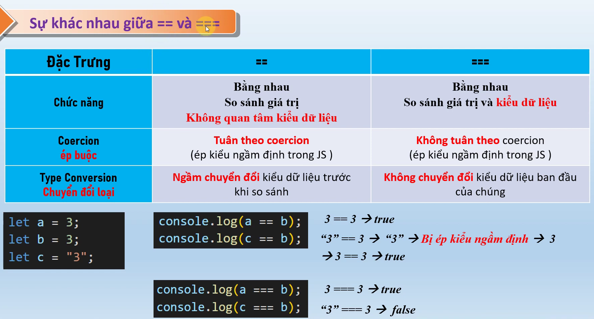
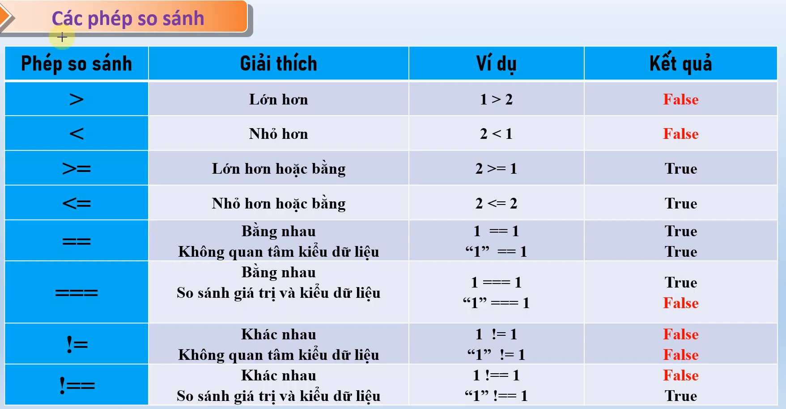

# nội dung bài học trên youtube
    - Bài 12. Toán tử So Sánh trong JS - sự khác nhau giữa == và === , khác nhau giữa != và !==
    - link bài học: https://www.youtube.com/watch?v=UXCVUut-pOs&list=PLPt6-BtUI22pYwpfmkP4EuJkf6GRe63KU&index=19

1. Nội dung bài học:
- toán tử so sánh 
- Khác nhau giữa == và === 
- Tìm hiểu thêm tái sao lại !== và != 