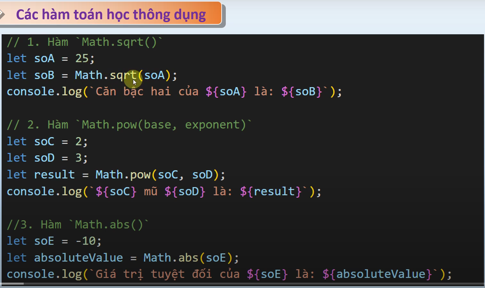
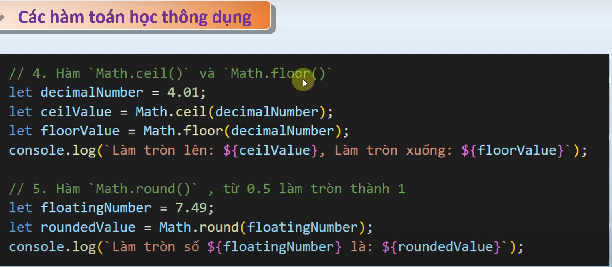
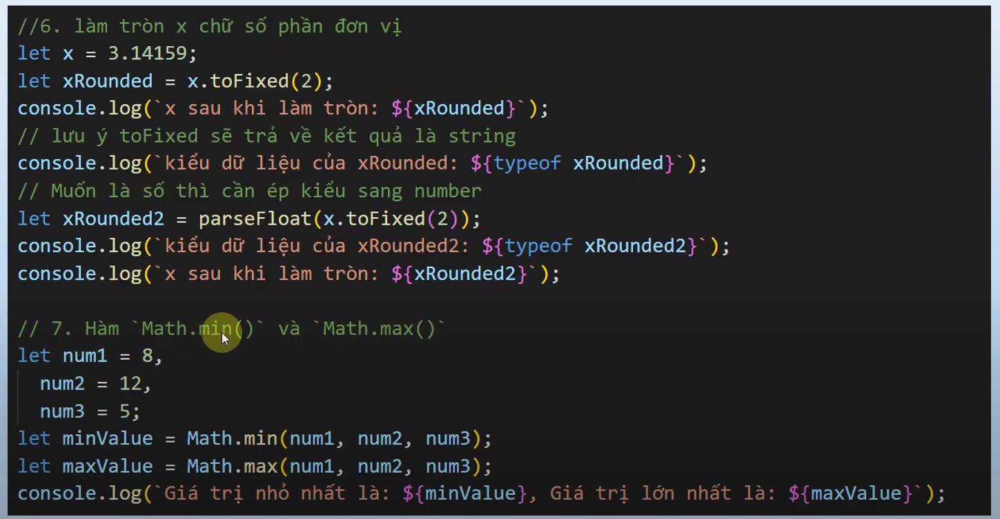

# nội dung bài học trên youtube
    - Bài 13. Các hàm toán học thông dụng trong javascript - Học JavaScript căn bản cho người mới
    - link bài học: https://www.youtube.com/watch?v=L7HlhpQwEsk&list=PLPt6-BtUI22pYwpfmkP4EuJkf6GRe63KU&index=21

1. Nội dung bài học:
- Các hàm toán học thông dụng 
, 
,
,
