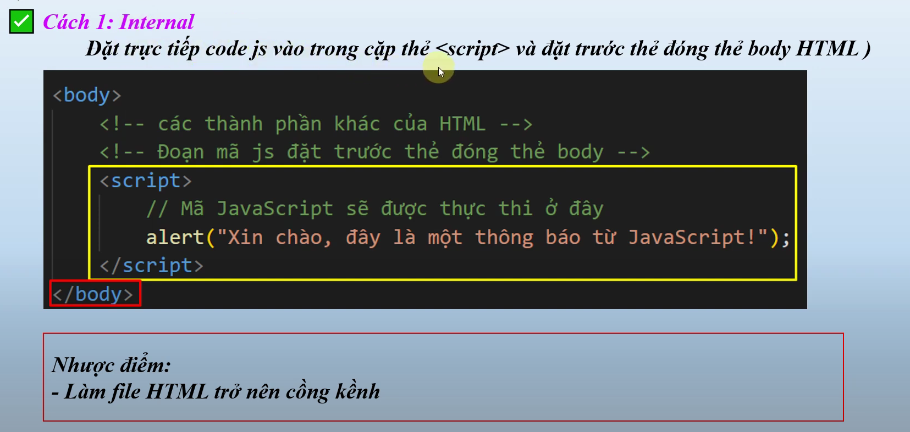
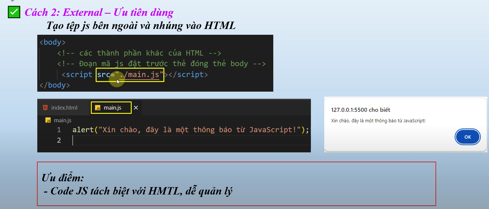

# nội dung bài học trên youtube
Bài 4. JavaScript Cho Người Mới Cách Thêm JavaScript vào HTML Đơn Giản - Nhập Môn JavaScript tuhoc.cc
    - link bài học : https://www.youtube.com/watch?v=nYiRE8YCVAo&list=PLPt6-BtUI22pYwpfmkP4EuJkf6GRe63KU&index=5

# Nội dung bài học 4:
1. Các cách thêm mã JS vào html
    - Cách 1 : use Internal ()
            

    - Cách 2 : use External
            