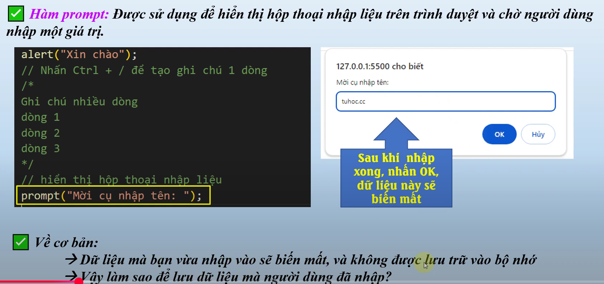

# nội dung bài học trên youtube
Bài 5.1 JavaScript variable_ Hướng Dẫn Chi Tiết về Khai Báo và Khởi Tạo Biến - JavaScript for beginner
    - link bài học : https://www.youtube.com/watch?v=NzeVBUgNnis&list=PLPt6-BtUI22pYwpfmkP4EuJkf6GRe63KU&index=6

1. Nội dung bài học 5:
    - trong nội dung ở bài 3 ta đã biết tác dụng và ý nghĩa của 2 hàm alert() và console.log để hiển thị dữ liệu
    - trong phần này ta lại tìm hiểu thêm 1 hàm hiển thị nữa đó là prompt()

    1.1 Hàm prompt()
        - vậy hàm prompt() là gì
            hàm prompt là 

2. Biến va khai báo biến 
    - đầu tiên bạn phải hiểu tại sao các từ khóa để khai báo biến là var, let, const lại liên quan tới ECMAScript (ECMA)
    - ECMA là gì ? -> (https://vi.wikipedia.org/wiki/ECMAScript)
    - Các giai đoạn phát triển của ECMA (https://www.w3schools.com/js/js_versions.asp)

    2.1, Khai báo và khởi tạo biến (var, let, const)
         Syntax : name_key tên_biến [=giá trị]; xem ví dụ sau : 

    - Nội dung Khai báo biến : https://youtu.be/NzeVBUgNnis?list=PLPt6-BtUI22pYwpfmkP4EuJkf6GRe63KU&t=415
        vd: var myName;
            let myName;

    - lỗi khai báo const https://youtu.be/NzeVBUgNnis?list=PLPt6-BtUI22pYwpfmkP4EuJkf6GRe63KU&t=443
    - Khởi tạo biến : https://youtu.be/NzeVBUgNnis?list=PLPt6-BtUI22pYwpfmkP4EuJkf6GRe63KU&t=462
        vd: var myName = "tuấn anh";
            let diemToan = 10;

    - Xuất giá trị biến : https://youtu.be/NzeVBUgNnis?list=PLPt6-BtUI22pYwpfmkP4EuJkf6GRe63KU&t=540
    - Xuất giá trị nối chuỗi : https://youtu.be/NzeVBUgNnis?list=PLPt6-BtUI22pYwpfmkP4EuJkf6GRe63KU&t=605
    - có thể gán lại or thay đổi const không : https://youtu.be/NzeVBUgNnis?list=PLPt6-BtUI22pYwpfmkP4EuJkf6GRe63KU&t=670