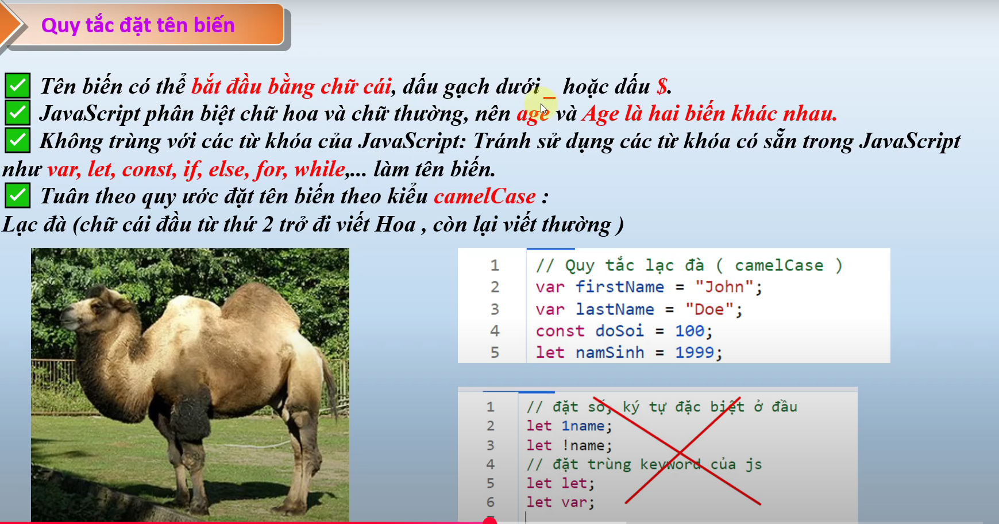

# nội dung bài học trên youtube
Bài 5.2. Quy Tắc Đặt Tên Biến JavaScript_ Bí Quyết để Viết Mã Đẹp và Dễ Đọc -Học JavaScript từ A đến Z
    - link bài học : https://www.youtube.com/watch?v=lyerFc4S_Jg&list=PLPt6-BtUI22pYwpfmkP4EuJkf6GRe63KU&index=7

# Nội dung bài học 5.2:
1. Quy tắc đặt tên biến
    
