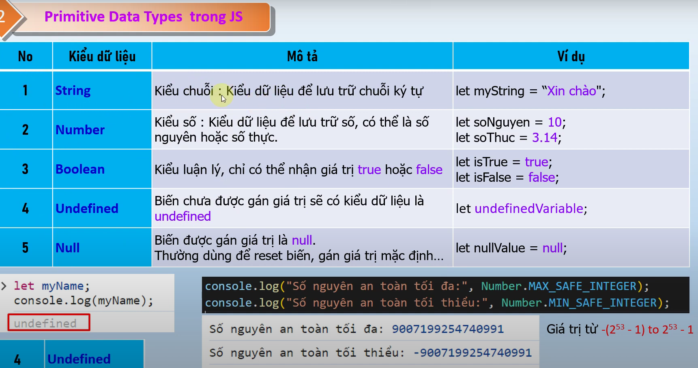

# nội dung bài học trên youtube
Bài 6. Primitive Data Types trong JavaScript - Understanding JavaScript Data Types- JavaScript siêu tốc
    - link bài học : https://www.youtube.com/watch?v=hyo1WKQmqpY&list=PLPt6-BtUI22pYwpfmkP4EuJkf6GRe63KU&index=8

# Nội dung bài học 6
1.Primitive Data Types js 
    - primitive data nnumber : https://youtu.be/hyo1WKQmqpY?list=PLPt6-BtUI22pYwpfmkP4EuJkf6GRe63KU&t=189
    - primitive data boolean : https://youtu.be/hyo1WKQmqpY?list=PLPt6-BtUI22pYwpfmkP4EuJkf6GRe63KU&t=275
    - primitive data undefined : https://youtu.be/hyo1WKQmqpY?list=PLPt6-BtUI22pYwpfmkP4EuJkf6GRe63KU&t=315
    - tại sao null lại trả về kiểu object : https://youtu.be/hyo1WKQmqpY?list=PLPt6-BtUI22pYwpfmkP4EuJkf6GRe63KU&t=388