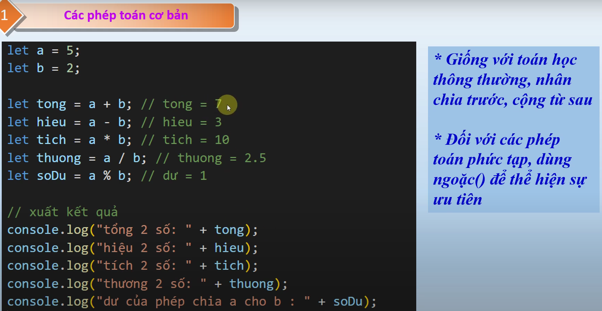

# nội dung bài học trên youtube
Bài 7.2 Các phép toán cơ bản trong JavaScript - Hướng dẫn tự học JS chi tiết cho người mới
    - link bài học : https://www.youtube.com/watch?v=n8pyentNuQg&list=PLPt6-BtUI22pYwpfmkP4EuJkf6GRe63KU&index=10\

Bài 7.3 Hướng dẫn quy tắc ưu tiên phép toán JavaScript 2024 - JavaScript Operator Precedence
    - link bài học : https://www.youtube.com/watch?v=NmWtc7dvHzs&list=PLPt6-BtUI22pYwpfmkP4EuJkf6GRe63KU&index=11

1. Nội dung bài học 7.2:
- Các phép toán cơ bản trong JavaScript 

2. Nội dung bài học 7.3:
- Quy tắc ưu tiên phép toán JavaScript 
- xem nội dung ưu tiên trong JS : https://developer.mozilla.org/en-US/docs/Web/JavaScript/Reference/Operators/Operator_precedence#:~:text=omit%20the%20associativity.-,Precedence,-Associativity
- thứ tự sẽ từ cao xuống thấp (18 -> 17... 1)