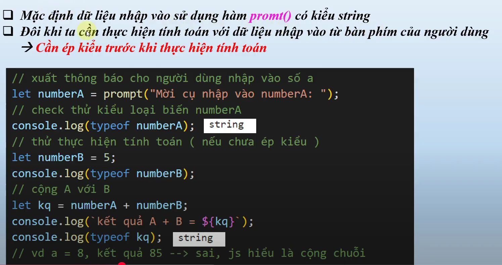
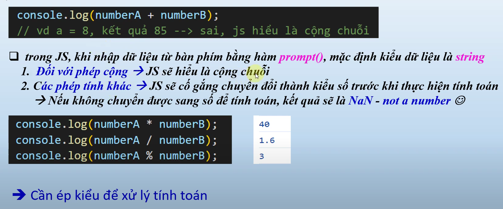
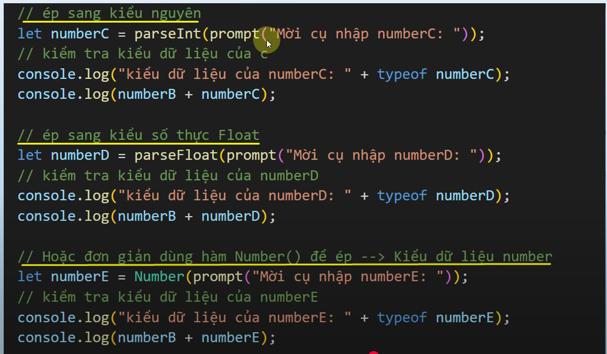

# nội dung bài học trên youtube
Bài 8. Ép Kiểu Dữ Liệu Trong JavaScript - Hướng Dẫn lập trình JavaScript chi tiết cho Người Mới Học
    - link bài học : https://www.youtube.com/watch?v=fq_lHjp2Hjs&list=PLPt6-BtUI22pYwpfmkP4EuJkf6GRe63KU&index=12

1. Nội dung bài học 8:
    - let numBerA = prompt("Nhập hộ bố mày cái bumber: ");
    - // làm sao biết khi nhập trong promt() là kiểu dữ liệu gì ?
    - console.log(typeof numBerA);
    - // tiếp theo thực hiện tính toán để (ép kiểu dữ liệu)
    - let numBerB = 10;
    - console.log(typeof numBerB);
    - // Vậy nếu ta lấy numBerA + numBerB thì như nào ?
    - let kq = numBerA + numBerB;
    - console.log(`Kết quả A + b = ${kq}`);
    - console.log(typeof kq);

2. Tại sao cần ép kiểu 
-  https://youtu.be/fq_lHjp2Hjs?list=PLPt6-BtUI22pYwpfmkP4EuJkf6GRe63KU&t=223
- Lưu Ý :  https://youtu.be/fq_lHjp2Hjs?list=PLPt6-BtUI22pYwpfmkP4EuJkf6GRe63KU&t=254
- Demo :  https://youtu.be/fq_lHjp2Hjs?list=PLPt6-BtUI22pYwpfmkP4EuJkf6GRe63KU&t=420