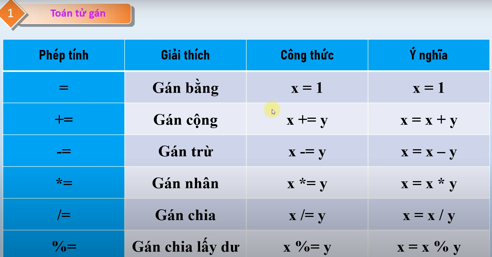
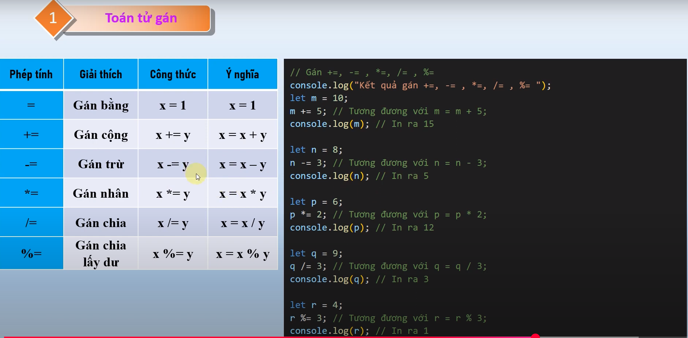

# nội dung bài học trên youtube
Bài 9. Toán tử gán trong JavaScript Hướng dẫn từ cơ bản đến nâng cao - Series Tự học JS từ A đến Z
    - link bài học : https://www.youtube.com/watch?v=Tgs1_HCP7rQ&list=PLPt6-BtUI22pYwpfmkP4EuJkf6GRe63KU&index=13

1. Nội dung bài học 9:
- Toán tử gán  https://youtu.be/Tgs1_HCP7rQ?list=PLPt6-BtUI22pYwpfmkP4EuJkf6GRe63KU&t=20
- Kết quả demo : 